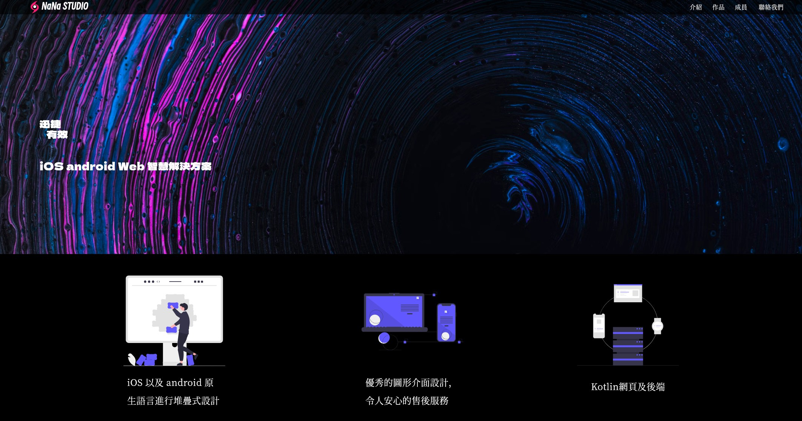
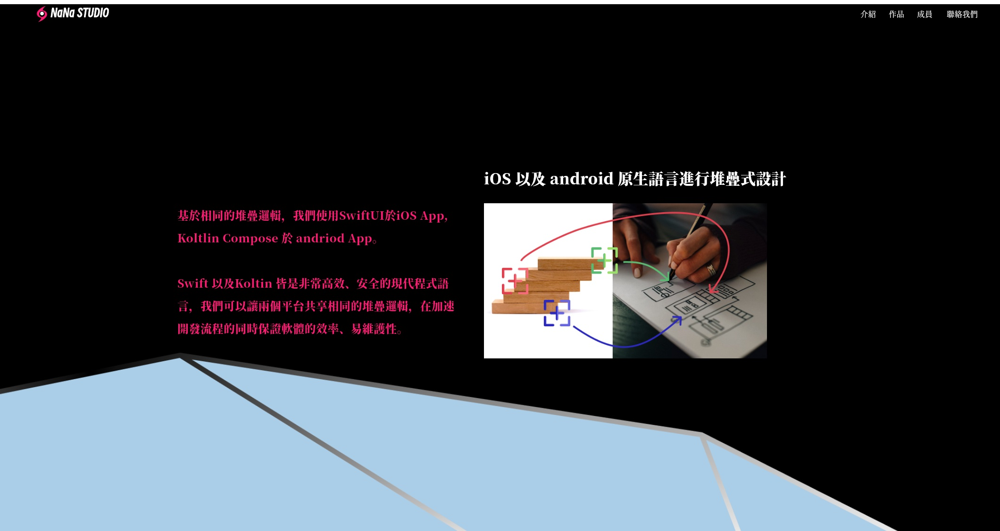
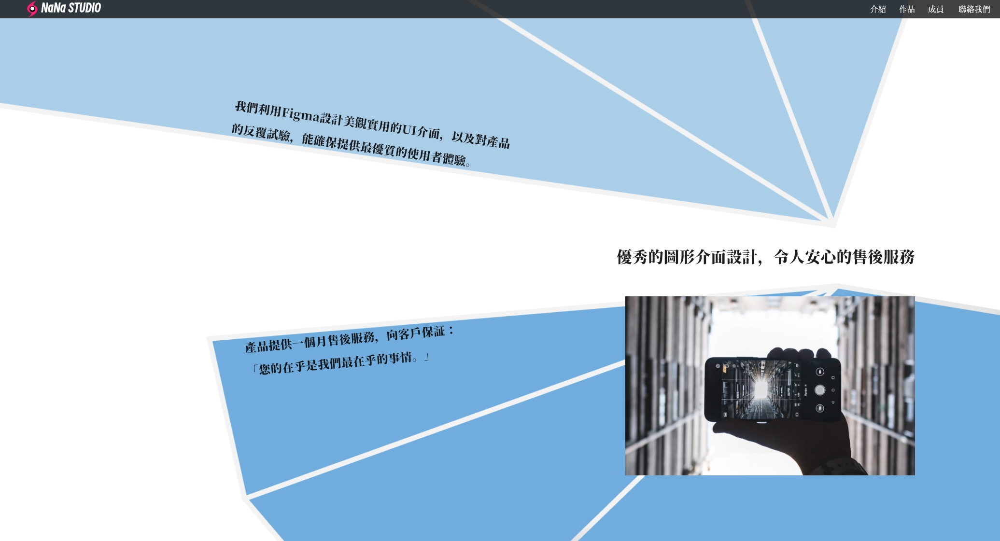
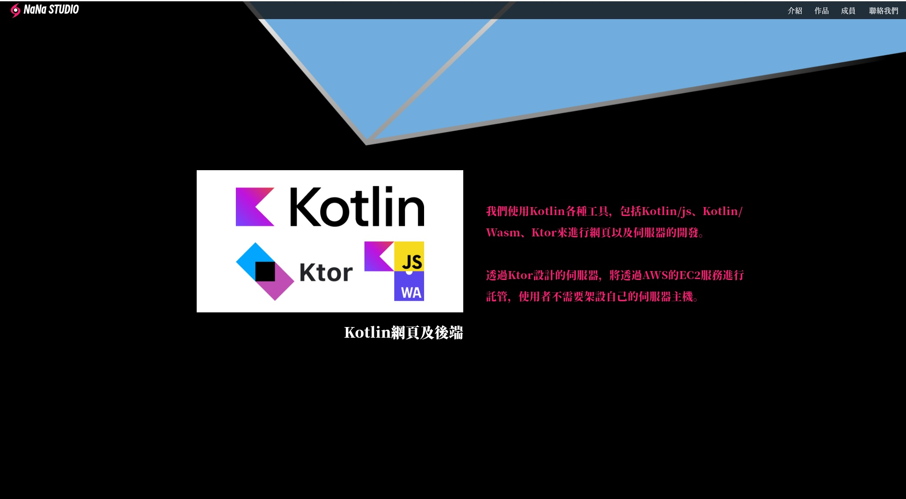

這是假想以一間科技公司為需求開發的網站，使用[Kotlin Wasm](https://kotlinlang.org/docs/wasm-overview.html)相關的技術，優點是可以用kotlin compose的語法進行編寫，對於習慣android開發的開發人員相對容易入手，並且理論上也會比傳統網頁擁有較高的性能。缺點是Kotlin Wasm的技術目前還在開發階段，相關的package還不完備，且中文支援還有問題，較老舊的遊覽器可能不支援。

